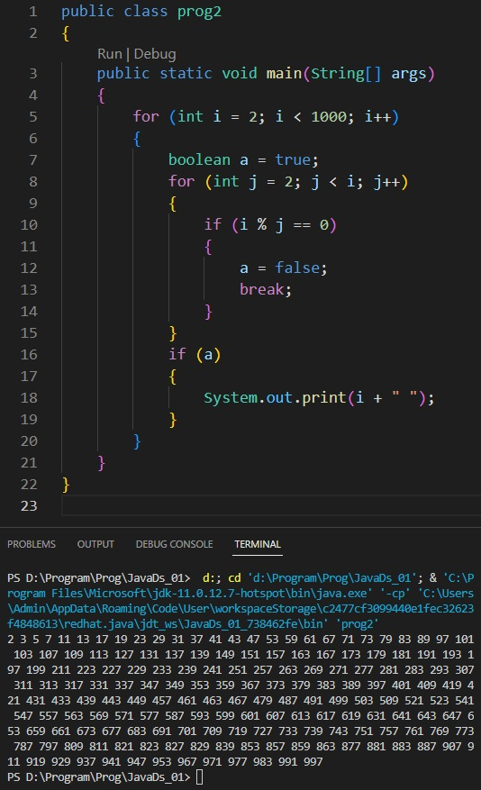

# Урок 1. Знакомство с языком программирования Java

## Задание 1
### Вычислить n-ое треугольного число(сумма чисел от 1 до n), n! (произведение чисел от 1 до n)

## Задание 2
### Вывести все простые числа от 1 до 1000

## Задание 3
### Реализовать простой калькулятор
